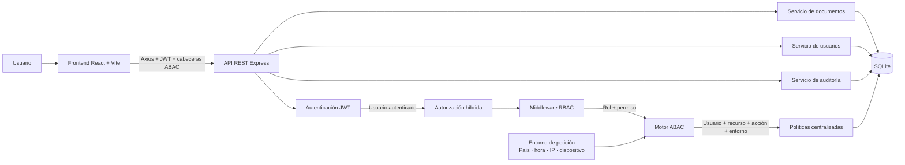
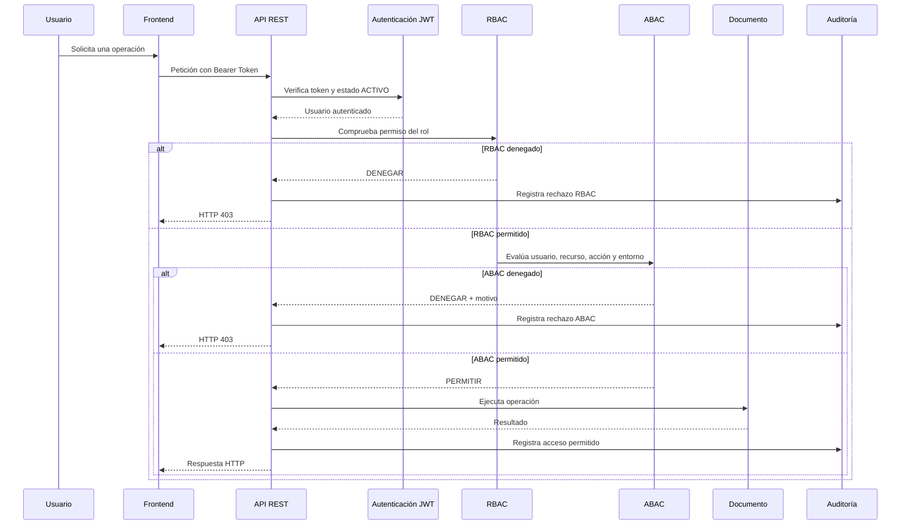

# Diagrama de Arquitectura - SecureDocs

**Estudiante:** Bellido Rony  
**Curso:** Desarrollo de Soluciones en la Nube

## Arquitectura general

## Flujo de autorización

## Componentes

| Componente | Responsabilidad |
|---|---|
| Frontend React | Login, dashboard, documentos, usuarios, auditoría y simulador ABAC. |
| Axios | Inyecta JWT y las cabeceras `x-country`, `x-device`, `x-time` y `x-forwarded-for`. |
| Autenticación JWT | Identifica al usuario y valida que su cuenta esté activa. |
| RBAC | Comprueba los permisos asignados al rol: leer, crear, modificar, eliminar, aprobar y auditar. |
| Motor ABAC | Evalúa las políticas centralizadas de departamento, nivel, propiedad, horario, país, dispositivo, estado e invitados. |
| Servicio de documentos | Ejecuta las operaciones CRUD y aprobación de documentos. |
| Servicio de usuarios | Administra usuarios, roles, departamentos, nivel de seguridad y estado. |
| Auditoría | Registra usuario, recurso, acción, fecha, resultado y motivo. |
| SQLite | Persistencia local de usuarios, roles, permisos, documentos y auditoría. |

## Ubicación en el código

- Frontend: `frontend/src`
- API y rutas: `backend/src/routes`
- Autenticación: `backend/src/middlewares/auth.middleware.ts`
- RBAC: `backend/src/middlewares/rbac.middleware.ts`
- ABAC: `backend/src/middlewares/abac.middleware.ts` y `backend/src/policies`
- Auditoría: `backend/src/middlewares/audit.middleware.ts`
- Base de datos: `backend/database.sqlite` y `backend/schema.sql`
