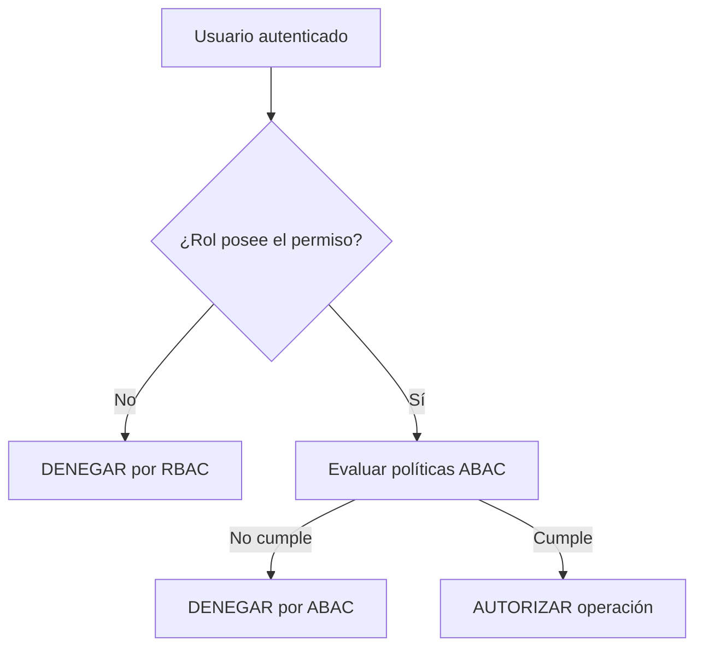

# Matriz RBAC - SecureDocs

**Estudiante:** Bellido Rony  
**Curso:** Desarrollo de Soluciones en la Nube

## 1. Objetivo

RBAC responde a la pregunta: **¿qué puede hacer un usuario debido a su rol?**

El middleware `checkRBAC` valida el permiso antes de ejecutar el motor ABAC. Si el rol no posee el permiso requerido, la API responde `403 Acceso denegado por RBAC` y registra el intento en auditoría.

## 2. Matriz de roles y permisos

| Operación | Código API | Administrador | Gerente | Supervisor | Empleado | Auditor | Invitado |
|---|---|:---:|:---:|:---:|:---:|:---:|:---:|
| Crear documento | `DOC_CREATE` | ✓ | ✓ | ✓ | ✓ | ✗ | ✗ |
| Consultar documento | `DOC_READ` | ✓ | ✓ | ✓ | ✓ | ✓ | ✓ |
| Modificar documento | `DOC_UPDATE` | ✓ | ✓ | ✓ | ✓ | ✗ | ✗ |
| Eliminar documento | `DOC_DELETE` | ✓ | ✓ | ✗ | ✗ | ✗ | ✗ |
| Aprobar documento | `DOC_APPROVE` | ✓ | ✓ | ✓ | ✗ | ✗ | ✗ |
| Ver auditoría | `AUDIT_READ` | ✓ | ✓ | ✗ | ✗ | ✓ | ✗ |
| Consultar usuarios | `USER_READ` | ✓ | ✗ | ✗ | ✗ | ✗ | ✗ |
| Registrar usuarios | `USER_CREATE` | ✓ | ✗ | ✗ | ✗ | ✗ | ✗ |
| Modificar usuarios | `USER_UPDATE` | ✓ | ✗ | ✗ | ✗ | ✗ | ✗ |
| Asignar roles | `ROLE_ASSIGN` | ✓ | ✗ | ✗ | ✗ | ✗ | ✗ |

## 3. Permisos por rol

| Rol | Permisos asignados |
|---|---|
| `ADMINISTRADOR` | `DOC_READ`, `DOC_CREATE`, `DOC_UPDATE`, `DOC_DELETE`, `DOC_APPROVE`, `USER_READ`, `USER_CREATE`, `USER_UPDATE`, `AUDIT_READ`, `ROLE_ASSIGN` |
| `GERENTE` | `DOC_READ`, `DOC_CREATE`, `DOC_UPDATE`, `DOC_DELETE`, `DOC_APPROVE`, `AUDIT_READ` |
| `SUPERVISOR` | `DOC_READ`, `DOC_CREATE`, `DOC_UPDATE`, `DOC_APPROVE` |
| `EMPLEADO` | `DOC_READ`, `DOC_CREATE`, `DOC_UPDATE` |
| `AUDITOR` | `DOC_READ`, `AUDIT_READ` |
| `INVITADO` | `DOC_READ` |

## 4. Relación entre rutas y permisos

| Ruta | Método | Permiso RBAC |
|---|---|---|
| `/api/documentos` | GET | `DOC_READ` |
| `/api/documentos` | POST | `DOC_CREATE` |
| `/api/documentos/:id` | GET | `DOC_READ` |
| `/api/documentos/:id` | PUT | `DOC_UPDATE` |
| `/api/documentos/:id` | DELETE | `DOC_DELETE` |
| `/api/documentos/:id/aprobar` | POST | `DOC_APPROVE` |
| `/api/usuarios` | GET | `USER_READ` |
| `/api/usuarios` | POST | `USER_CREATE` |
| `/api/usuarios/:id` | PUT | `USER_UPDATE` |
| `/api/usuarios/:id/estado` | PATCH | `USER_UPDATE` |
| `/api/auditoria` | GET | `AUDIT_READ` |

## 5. Flujo de decisión RBAC + ABAC

Tener un permiso RBAC no garantiza el acceso final. El permiso debe complementarse con una evaluación ABAC válida para el documento y el entorno de la petición.

## 6. Archivos de implementación

- Matriz en código: `backend/src/middlewares/rbac.middleware.ts`
- Catálogo y asignaciones persistentes: `backend/src/initDb.TS`
- Rutas protegidas: `backend/src/routes`
- Auditoría de decisiones: `backend/src/middlewares/audit.middleware.ts`
