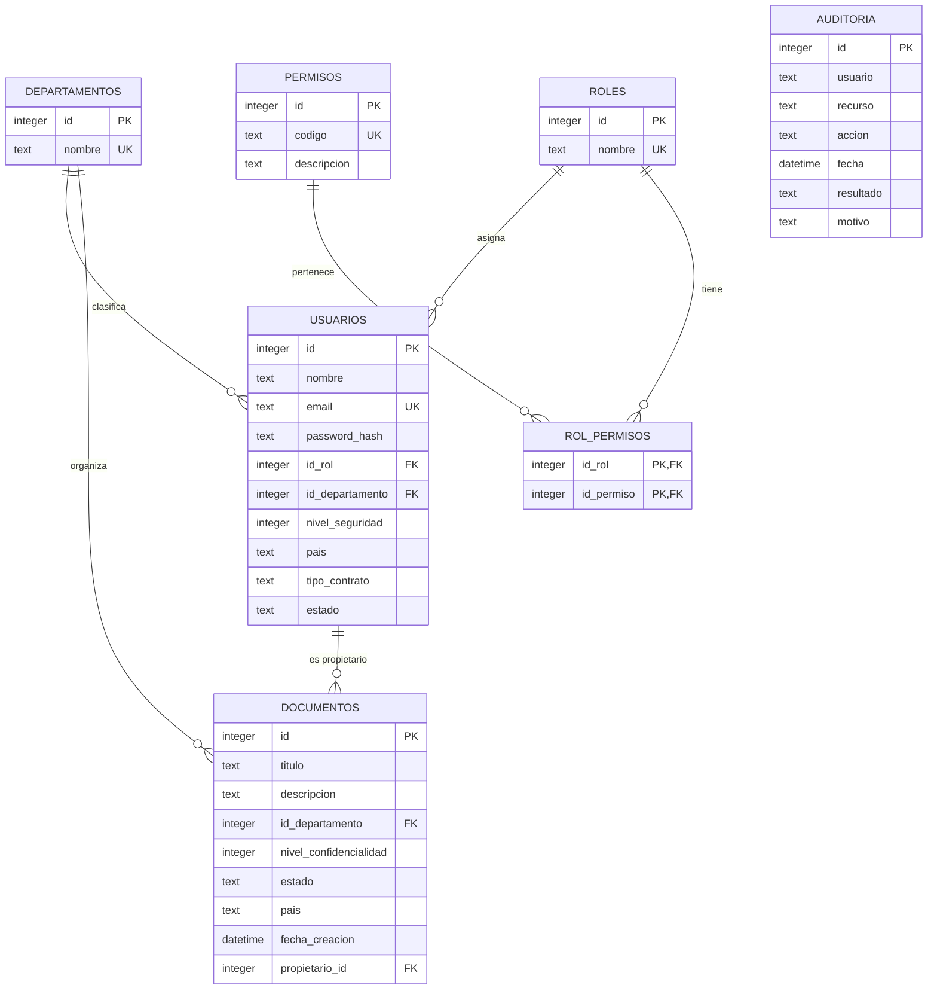

# Modelo de Datos - SecureDocs

**Estudiante:** Bellido Rony  
**Curso:** Desarrollo de Soluciones en la Nube

## 1. Modelo entidad-relación

El siguiente diagrama representa las tablas físicas creadas por el seed SQLite de SecureDocs:



La tabla `AUDITORIA` no tiene una clave foránea hacia `USUARIOS` porque guarda el nombre del usuario como evidencia histórica. Esto permite conservar el registro aunque el usuario cambie o sea eliminado.

## 2. Tablas y propósito

| Tabla | Propósito |
|---|---|
| `departamentos` | Catálogo de áreas de la organización. |
| `roles` | Roles RBAC disponibles en el sistema. |
| `permisos` | Operaciones autorizables de la aplicación. |
| `rol_permisos` | Tabla intermedia entre roles y permisos. |
| `usuarios` | Identidades, atributos de seguridad y relaciones RBAC/ABAC. |
| `documentos` | Recursos protegidos por RBAC y ABAC. |
| `auditoria` | Registro de cada intento de acceso y su resultado. |

## 3. Relaciones principales

### Usuario, rol y departamento

- Cada usuario puede tener un rol mediante `usuarios.id_rol -> roles.id`.
- Cada usuario pertenece a un departamento mediante `usuarios.id_departamento -> departamentos.id`.
- Un rol puede asignarse a muchos usuarios.
- Un departamento puede contener muchos usuarios.

### Rol y permisos

La relación entre roles y permisos es de muchos a muchos:

```text
ROLES 1 ──── N ROL_PERMISOS N ──── 1 PERMISOS
```

La clave primaria compuesta de `rol_permisos` evita asignar dos veces el mismo permiso al mismo rol.

### Documento y propietario

- Cada documento pertenece a un departamento mediante `documentos.id_departamento`.
- Cada documento tiene un propietario mediante `documentos.propietario_id -> usuarios.id`.
- Un usuario puede ser propietario de muchos documentos.

### Auditoría

Cada intento protegido registra:

- usuario que realizó la solicitud;
- recurso solicitado;
- acción ejecutada;
- fecha y hora;
- resultado `PERMITIDO` o `DENEGADO`;
- motivo de la decisión.

## 4. Atributos utilizados por ABAC

### Atributos del usuario

| Campo | Tabla | Uso |
|---|---|---|
| `id` | `usuarios` | Identidad y propiedad. |
| `id_departamento` | `usuarios` | Política de departamento. |
| `nivel_seguridad` | `usuarios` | Comparación con confidencialidad. |
| `pais` | `usuarios` | Restricción geográfica. |
| `tipo_contrato` | `usuarios` | Restricción para invitados. |
| `estado` | `usuarios` | Bloqueo de usuarios inactivos. |

### Atributos del documento

| Campo | Tabla | Uso |
|---|---|---|
| `id_departamento` | `documentos` | Política de departamento. |
| `nivel_confidencialidad` | `documentos` | Nivel mínimo de seguridad, horario y dispositivo. |
| `estado` | `documentos` | Requisito `PUBLICADO` para invitados. |
| `pais` | `documentos` | Restricción geográfica. |
| `propietario_id` | `documentos` | Restricción de modificación. |

### Atributos del entorno

Los atributos de entorno no se almacenan como columnas permanentes; llegan con cada petición HTTP y son evaluados por el middleware ABAC:

| Atributo | Cabecera HTTP | Ejemplo |
|---|---|---|
| Hora | `x-time` | `10:00` |
| País / ubicación | `x-country` | `PERU` |
| Dirección IP | `x-forwarded-for` | `192.168.10.20` |
| Dispositivo | `x-device` | `CORPORATIVO` |

## 5. Restricciones principales

- `nivel_seguridad` y `nivel_confidencialidad`: valores del 1 al 5.
- `tipo_contrato`: `INTERNO` o `EXTERNO`.
- Estado de usuario: `ACTIVO` o `INACTIVO`.
- Estado de documento: `PENDIENTE`, `PUBLICADO` o `RECHAZADO`.
- Resultado de auditoría: `PERMITIDO` o `DENEGADO`.
- `email`, nombres de roles, nombres de departamentos y códigos de permisos son únicos donde corresponde.

## 6. Fuente de verdad

- Esquema de referencia: `backend/schema.sql`.
- Esquema ejecutado localmente: `backend/src/initDb.TS`.
- Archivo de persistencia local generado: `backend/database.sqlite`.

La tabla `politicas` aparece en `backend/schema.sql` como catálogo conceptual de políticas, pero actualmente las reglas ejecutables están centralizadas en `backend/src/policies/rules.ts` y el seed SQLite no crea esa tabla. La autorización efectiva utiliza esas reglas centralizadas.
